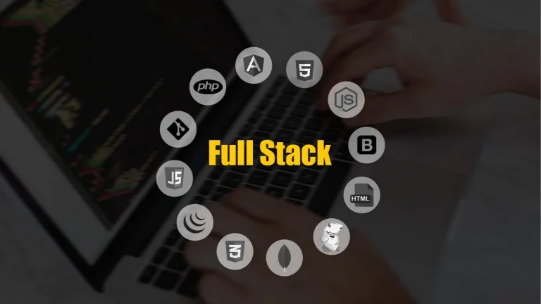
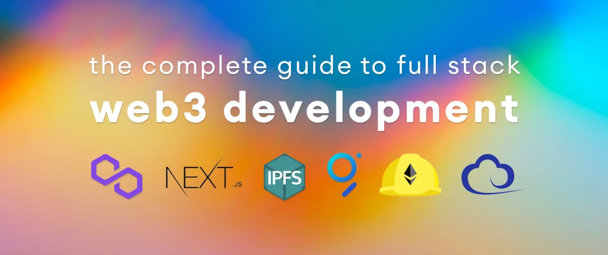
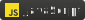

## Skills

- 🌱 Frontend : React.js, Vue.js, Next.js, Nuxt.js, React Native, Angular.js, Svelte, Jquery, Tailwind, Bootstrap, Vuetify, MDB react, LESS/SASS
- 🔭 Backend : Express, Nest.js, Laravel, Django, Ruby on Rails
- 🧩 Database : MySQL, PostgreSQL, MongoDB, SQLite
- 💬 Language : HTML, CSS, Javascript, Typescript, Python, PHP, Ruby
- 📫 Interesting : Web, Blockchain, mobile
- Cypress, Mocha, AWS, Rest API
- Blockchain, Web3.js, Ether.js, Solidity, Truffle, Hardhat, IPFS
  

## Tools

  
  
  
  
  
  
  
  
  
  
  
  
  
  
  
  
  
  
  
  
  
  
  
  
  
  
  
  
  
  
  
  

 

  <h2>
    
      How to reach me
    
  </h2>
   
  

    Telegram: @phantomdev0302  
    Discord: @phantomdev0302#7986  
    WhatsApp: +13042509060  
  

  
<!--
**redsky500/redsky500** is a ✨ _special_ ✨ repository because its `README.md` (this file) appears on your GitHub profile.

Here are some ideas to get you started:

- 🔭 I’m currently working on ...
- 🌱 I’m currently learning ...
- 👯 I’m looking to collaborate on ...
- 🤔 I’m looking for help with ...
- 💬 Ask me about ...
- 📫 How to reach me: ...
- 😄 Pronouns: ...
- ⚡ Fun fact: ...
-->
